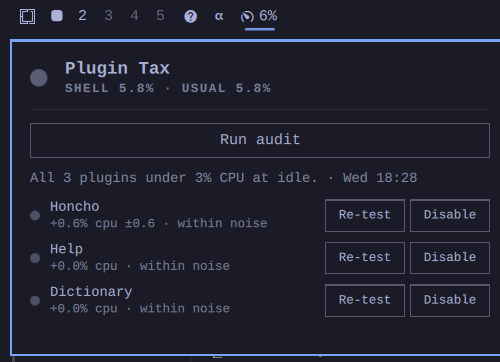

# Plugin Tax



An Omarchy shell plugin that watches the shell's own idle CPU headroom and,
on demand, finds out which enabled third-party plugin is spending it.

## Why

Omarchy plugins are QML loaded into one long-lived, unsandboxed `quickshell`
process — there's no per-plugin PID, so the OS scheduler can't hand you a
"this plugin costs X% CPU" number the way `top` can for a normal process.
The only reliable way to attribute cost is the manual test that already
caught a real CPU leak on the author's machine (a wallpaper shader plugin
quietly burning ~16% CPU at idle): disable the plugin, compare whole-shell
CPU before and after, re-enable it. This plugin automates that test and
runs it across every enabled third-party plugin instead of one at a time
by hand.

## What it does

- **Bar pill (continuous, cheap):** every 20s, samples the shell **and every
  live process under it** — plugin helper daemons included — over a 1.2s
  window. The tooltip splits it: shell itself, helpers (naming the busiest
  one), and the "usual" level (20th percentile of the last 30 min). The pill
  turns urgent when two samples in a row sit 8%+ above usual. One sample
  costs about 50 ms of CPU (≈0.25% of a core at this interval).
- **Run audit (on demand):** for each enabled, third-party, non-`bar`-kind
  plugin, runs interleaved rounds — ON, OFF, ON, OFF, ON by default — and
  compares each OFF with the ON samples on either side. It reports the
  median delta ± spread, plus the CPU of the plugin's own helper processes,
  measured directly (processes whose command line lives in the plugin's
  folder). Verdicts: **flagged** (≥3% and every round agrees, or helpers
  ≥3%), **minor**, **within noise**. Progress and time left are shown on
  the button. About 20s per plugin.
- **Re-test** per row: re-measures just that plugin (~25s) and updates its
  row — useful after updating a plugin or when a result is "within noise".
- **Disable / Re-enable** per row. Re-enable puts the widget back in its
  original bar slot with its settings.

### What the audit's number actually is

Per sample: the shell process (all threads) plus its **live** helper
processes, taken as the median of five 0.4s slices. Two things are left out
on purpose, because every toggle rewrites `shell.json` and the shell reacts
to that far more loudly than most plugins cost:

- **Omarchy's own tooling.** A config write makes first-party plugins
  refresh — `omarchy-agent-usage` (which launches `codex`), `omarchy-network`,
  `omarchy-monitor`, a package-status check. Measured on this machine:
  bursts of 100–500% for about a second, repeating for ~10s. Processes whose
  command line runs an `omarchy-*` tool or lives under `/usr/share/omarchy/`
  are pruned from the audit's tree (never anything under
  `~/.config/omarchy/plugins/`). Override with `PLUGIN_TAX_IGNORE_RE`.
- **Children born and reaped inside the window.** Once dead their origin
  can't be attributed.

After each toggle the audit also waits until the tree is back within 2% of
the level before the plugin was touched (up to 10s) before sampling.

With those in place the e2e fixtures read 17.1% ±0 and 12.2% ±0; before,
the same run gave spreads of ±22–55% on ordinary plugins.

The bar pill uses the same metric, so its number and the audit's agree,
and it skips the first sample after startup or an audit (the shell is busy
reloading then).

### Why the audit measures a process tree, not a PID

A child process's CPU reaches its parent's `cutime` only when the child
exits. A plugin whose work lives in a helper daemon therefore looks free if
you read only the shell's own `/proc/PID/stat` — which is how v0.1 worked.

### How the audit keeps your bar intact

`omarchy plugin disable` removes a bar widget's layout entry, and
`omarchy plugin enable` re-inserts a bare one at the default slot — that
loses both position and per-widget settings. So the audit never calls
`enable`: it snapshots `shell.json` first and writes the exact snapshot
back after each OFF sample (the shell watches the file and reloads), then
waits until the shell reports the plugin enabled again before moving on.

If the audit is killed hard (shell crash, SIGKILL) the journal in
`~/.local/state/plugin-tax/` records which plugin was off; the next time
the service starts it puts **only that plugin** back in its old slot,
keeping any other config changes made since. A lock stops two audits (or
an audit and a recovery) from running at once.

If `shell.json` is changed by something else while a plugin is off
(Settings, dragging a widget), the audit notices, keeps that change, puts
only the audited plugin back in its slot, and says so in the panel.

First-party plugins and full-bar replacements (`kind: "bar"`) are still
excluded: toggling core Omarchy UI is a worse kind of disruptive.

## Requirements

Nothing to install on a standard Omarchy system. It uses `bash`, `gawk`,
`jq`, `flock` (util-linux) and the `omarchy` CLI, all present by default.
No network access, no root, no background daemon: the only process it
runs continuously is a 1.2s sample every 20s.

## What it changes on your system

- **Run audit** switches plugins off and on through `omarchy plugin
  disable`, and restores `~/.config/omarchy/shell.json` from the copy it
  took before starting. It only does this when you press the button.
- **Disable / Re-enable** on a result row does the same for one plugin.
- State lives in `~/.local/state/plugin-tax/` (last audit, crash journal,
  saved placements). Removing the plugin leaves that folder behind; delete
  it if you like.

## Structure

```
manifest.json           schema + two entry points (service, bar-widget)
Service.qml             sampling timer, audit orchestration, IPC handler
BarWidget.qml           bar pill + popup panel
Model.js                pure parsing / statistics / verdicts (node-tested)
bin/plugin-tax-sample   one CPU/RSS sample of the shell's process tree
bin/plugin-tax-audit    audit, crash recovery, placement-preserving disable/re-enable
tests/model.test.js     node --test tests/*.test.js
tests/audit.test.sh     restore/recovery paths against a mock omarchy CLI
tests/e2e.sh            LIVE: fixture plugins that burn CPU, full audit via IPC
```

## IPC

```
omarchy-shell renardoberou.plugin-tax runAudit
omarchy-shell renardoberou.plugin-tax runAuditOnly <plugin-id>
omarchy-shell renardoberou.plugin-tax status | jq
```

## Install / remove

```
omarchy plugin add https://github.com/renardoberou/omarchy-plugin-tax --enable
omarchy plugin remove renardoberou.plugin-tax
```

## Local dev

```
omarchy plugin validate .
ln -sfn "$PWD" ~/.config/omarchy/plugins/renardoberou.plugin-tax
omarchy plugin enable renardoberou.plugin-tax
omarchy restart shell
journalctl --user -t omarchy-shell --since "1 minute ago" | grep plugin-tax
```

Tests:

```
node --test tests/*.test.js     # pure logic
./tests/audit.test.sh           # audit restore paths, mock CLI, no shell touched
./tests/e2e.sh                  # live shell; disruptive, ~2-3 min
```

Note: the shell only watches `~/.config/omarchy/plugins` itself, so edits
inside a symlinked dev checkout need `omarchy restart shell` to load.

## Known limits

- Idle-glance history resets on every shell restart (the last audit and
  the Disabled list do persist).
- The toggle delta is still a statistical measurement: costs under ~1%
  are reported as "within noise" rather than guessed at.
- Short-lived processes a plugin spawns (e.g. a `hyprctl` call every few
  seconds) are **not measured** by the pill or the audit — they exit before
  they can be attributed. Only the QML work of starting them and reading
  their output is counted (it runs in the shell's own process).
- A third-party plugin that does its work through `omarchy-*` CLI tools is
  under-counted for the same reason Omarchy's own refreshes are excluded.
- Helper attribution is by command line. A helper started through a
  wrapper that hides the plugin's path (e.g. `sh -c` with a relative path)
  still counts in the toggle delta, just not as "helpers".
- GPU time isn't measured; render-thread CPU is (it's part of the shell's
  process).
